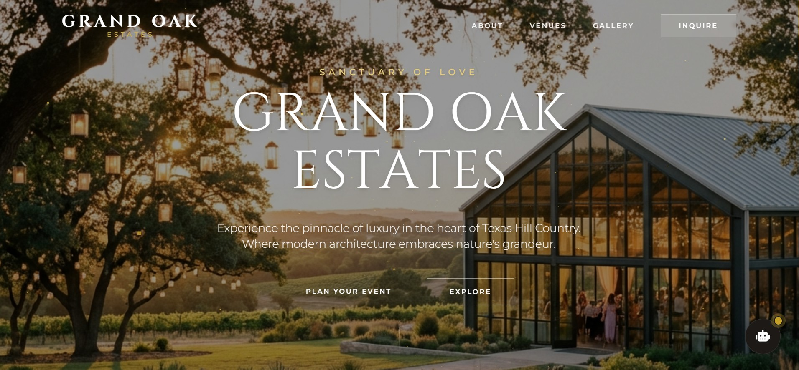

# 💍 AI Wedding & Event Lead Management Agent

   
  
*A High-Speed, RAG-Powered AI Agent for Instant Lead Conversion and Booking*

---

## 🧠 Overview

**AI Wedding Agent** is a sophisticated lead management and customer engagement platform designed specifically for the high-stakes wedding and event industry. It bridges the gap between potential clients and service providers by providing instantaneous, intelligent responses to inquiries. Built with **Retrieval-Augmented Generation (RAG)**, the agent doesn't just chat—it knows your packages, policies, and availability inside out.

---

## 📽️ Project Demonstration

    
    
<i>Click above to watch the AI Agent in action: Handling leads and booking meetings in real-time.</i>

---

## 📸 Visual Walkthrough & Features

Experience the seamless journey from inquiry to confirmed booking.

### 1. The Command Center

    

<i>The comprehensive dashboard allows you to monitor all active conversations, track agent performance, and manage leads in one place.</i>

### 2. Instant Lead Engagement

    

<i>As soon as a potential client reaches out, the AI responds instantly, ensuring no lead is left waiting. The agent introduces itself professionally and begins the qualification process.</i>

### 3. Smart Availability Check

    

<i>Using simple natural language, the agent answers complex questions about services and pricing by retrieving accurate data from your knowledge base.</i>

### 4. Collecting Info and Booking Meeting

    

<i>The agent connects directly to your Google Calendar to check for availability in real-time, ensuring no double-booking ever occurs.</i>

### 5. Automated Meeting Proposal

    

<i>Instead of back-and-forth emails, the agent proactively asks for a meeting about calendar automation and proposes specific available time slots found in your calendar.</i>

### 6. Seamless Booking Confirmation

    

<i>Once the client selects a time, the meeting is instantly booked. Creating a calendar event automatically and sending a confirmation to both parties.</i>

---

---

---

## 💡 The Problem: Why Traditional Booking Fails

In the professional wedding and event industry, **Time** is the most critical currency. This platform directly addresses the deep-seated inefficiencies that plague venue owners and service providers:

### The "Golden Hour" of Interest
Marketing data shows that a lead is **21x more likely** to convert if contacted within 5 minutes.
- **The Reality**: Most businesses operate manually. A client inquires on a Friday night, but the owner doesn't see it until Monday morning.
- **The Consequence**: By then, the client has already booked a competitor who replied instantly or has simply lost the emotional excitement of the moment. We call this the "Lead Ghosting Gap."

### The Burden of Repetition
Event professionals spend hours answering the same questions: *"What's your pricing?", "Are you free on May 15th?", "Do you allow outside catering?"*
- **The Reality**: Owners are often on-site managing events, unable to sit at a computer. Answering emails becomes a late-night chore.
- **The Consequence**: Burnout and missed opportunities. When owners are busy, new business suffers.

---

## ✨ Our Solution: The AI Concierge

We haven't just built a chatbot; we've built an **Autonomous AI Relationship Manager** that simulates a highly fitted sales representative.

### 1. Hyper-Personalized Knowledge (RAG)
Unlike generic chatbots, this agent uses **Retrieval-Augmented Generation**. We ingest your specific brochures, pricing PDFs, and FAQs into a vector database.
- **How it works**: When a user asks a niche question, the AI "reads" your specific documents to craft a perfect answer. It doesn't hallucinate; it cites your actual policies.

### 2. Live Calendar Negotiation
Scheduling a tour or meeting usually takes 4-5 emails back and forth.
- **How it works**: The agent has real-time read/write access to your Google Calendar. It knows when you are free. It proposes slots *intelligently*, avoiding conflicts, and books the event directly into your schedule without you lifting a finger.

### 3. Emotional Intelligence
Weddings are emotional. A robotic response kills the mood.
- **How it works**: The AI is prompted with a specific persona—warm, celebratory, and professional. It uses emojis, congratulates couples, and guides them gently through the funnel, creating a "concierge" experience rather than a "form-filling" one.

---

## 🛠️ Technology Stack

| Layer | Technology | Usage |
| :--- | :--- | :--- |
| **LLM & AI** | **Google Gemini 2.5 Flash** | Core reasoning, NLP, and conversation generation. |
| **Knowledge Base** | **RAG (Retrieval-Augmented Generation)** | Contextualizing AI with your specific business data. |
| **Backend** | **Python / Flask** | Scalable API and application logic. |
| **Database & Auth** | **Firebase (Firestore/Auth)** | Real-time lead storage and secure user management. |
| **Cloud Hosting** | **Google Cloud Platform** | Production-grade hosting for high availability. |
| **Integrations** | **Google Calendar API** | Seamless scheduling and tour management. |

---

**Built for Modern Event Professionals**  
*Empowering businesses with AI speed.*

