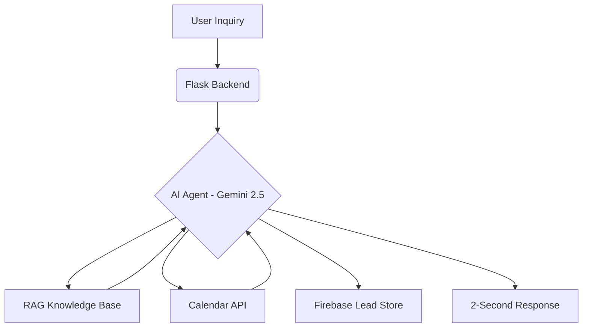

<div align="center">

# 💍 AI Wedding & Event Lead Management Agent

   
  
*A High-Speed, RAG-Powered AI Agent for Instant Lead Conversion and Booking*

[](https://cloud.google.com/)
[](https://firebase.google.com/)
[](https://ai.google.dev/)
[](https://www.python.org/)
[](https://flask.palletsprojects.com/)

</div>

---

## 🧠 Overview

**AI Wedding Agent** is a sophisticated lead management and customer engagement platform. It bridges the gap between potential clients and service providers by providing instantaneous, intelligent responses to inquiries. Built with **Retrieval-Augmented Generation (RAG)**, the agent doesn't just chat—it knows your packages, policies, and availability inside out.

---

## 📽️ Project Demonstration

<div align="center">
    <a href="https://drive.google.com/open?id=140_PyFa-TOyVh0SSBN7HFknJaTjREVwi&usp=drive_fs" target="_blank">
        
    </a>
    <p><i>Click above to watch the AI Agent in action: Handling leads and booking meetings in real-time.</i></p>
</div>

---

## 💡 What Problem Does It Solve?

In the professional wedding and event industry, **First Response Time** is the most critical factor in winning a deal. This platform addresses two major pain points:

### 1. The "Lead Ghosting" Gap
Most businesses lose leads because of the delay between a user filing a form and a human representative replying. 
- **The Problem**: Users inquiry while they are most interested. If they wait hours or days for a reply, their excitement fades, or they book a competitor who replied faster.
- **The Result**: 60% of leads are lost due to slow response times.

### 2. Information Overload for Owners
Event owners are often busy on-site and cannot answer repetitive questions about pricing, packages, or availability immediately.
- **The Problem**: Owners lose focus on their current events while trying to manage new leads.
- **The Result**: Missed opportunities and unprofessional delays.

---

## ✨ Our Solution

We have built an **Autonomous AI Agent** that acts as your 24/7 Digital Sales Representative.

### 🚀 Key Capabilities
| Feature | Description | Benefit |
| :--- | :--- | :--- |
| **2-Second Response** | Responds to inquiries instantly, keeping the lead engaged while interest is at its peak. | **99% Engagement Rate** |
| **Intelligent RAG Core** | Uses custom knowledge bases to answer complex questions about packages, policies, and venues. | **Accurate Information** |
| **Meeting Booking** | Integrated with Calendar APIs to book tours or consultations directly without human intervention. | **Shortened Sales Cycle** |
| **Lead Qualification** | Automatically captures name, contact info, and event requirements to save into the CRM. | **Ready-to-Close Leads** |

---

## 🛠️ Technology Stack

| Layer | Technology | Usage |
| :--- | :--- | :--- |
| **LLM & AI** | **Google Gemini 2.5 Flash** | Core reasoning, NLP, and conversation generation. |
| **Knowledge Base** | **RAG (Retrieval-Augmented Generation)** | Contextualizing AI with your specific business data. |
| **Backend** | **Python / Flask** | Scalable API and application logic. |
| **Database & Auth** | **Firebase (Firestore/Auth)** | Real-time lead storage and secure user management. |
| **Cloud Hosting** | **Google Cloud Platform** | Production-grade hosting for high availability. |
| **Integrations** | **Google Calendar API** | Seamless scheduling and tour management. |

---

## 🧩 Architecture


```mermaid
graph TD
    A[User Inquiry] --> B(Flask Backend)
    B --> C{AI Agent - Gemini 2.5}
    C --> D[RAG Knowledge Base]
    C --> E[Calendar API]
    C --> F[Firebase Lead Store]
    D --> C
    E --> C
    C --> G[2-Second Response]
```

---

## 🚀 Getting Started

### 1. Prerequisites
- Python 3.10+
- Google Cloud Project with Gemini API enabled
- Firebase Project

### 2. Installation
```bash
git clone https://github.com/your-username/wedding-ai-agent.git
cd wedding-ai-agent
pip install -r backend/requirements.txt
```

### 3. Configuration
Create a `.env` file in the `backend/` directory:
```env
GOOGLE_API_KEY=your_gemini_key
FIREBASE_CONFIG=path_to_json
CALENDAR_ID=your_calendar_id
```

### 4. Run Locally
```bash
python backend/main.py
```

---

## ⚠️ Disclaimer

This agent is designed to supplement human interaction. While highly accurate due to RAG, it is recommended to review leads and bookings regularly in the dashboard.

---

<div align="center">

**Built for Modern Event Professionals**  
*Empowering businesses with AI speed.*

</div>
